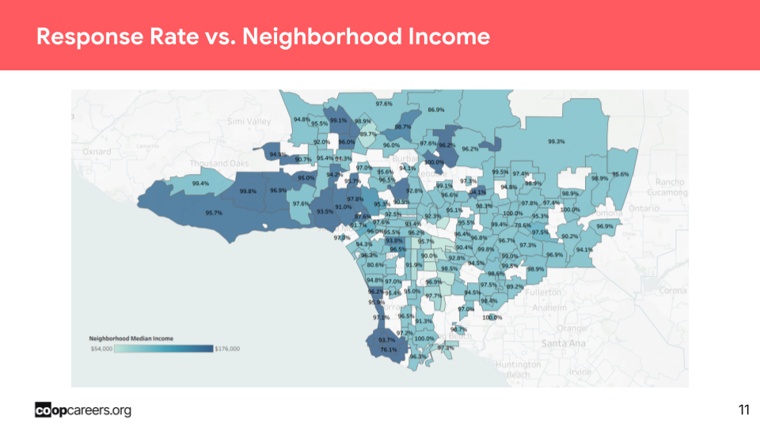
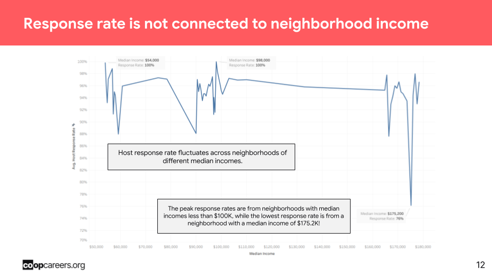
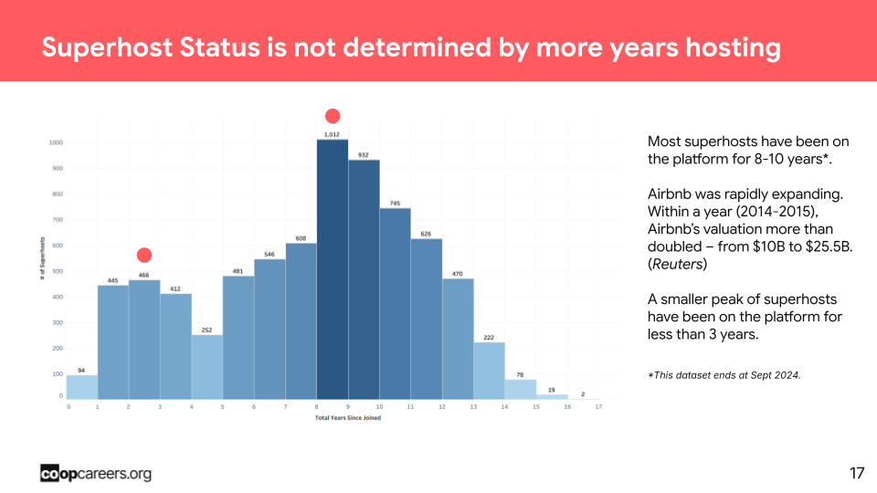

# Airbnb-Los-Angeles-Market-Analysis
Exploratory data analysis and cleaning of 45K+ Airbnb listings across Los Angeles using Python. Includes a property type classifier consolidating 25+ raw categories, context-driven null handling, and geographic feature engineering for Tableau compatibility. Findings include host response rate analysis across 100+ neighborhoods.

## Purpose
This project analyzes Airbnb listing data across Los Angeles to uncover patterns in host behavior, pricing, and neighborhood-level performance. The cleaned dataset was also prepared for downstream Tableau visualization by a collaborative data team.

## Objective
Perform exploratory data analysis and cleaning on 45,000+ LA Airbnb listings to ensure data integrity, standardize inconsistent values, and surface actionable insights about host engagement and superhost distribution.

## Findings
- Host response rate has no correlation with neighborhood income. Peak response rates (100%) were found in neighborhoods with median incomes under $100K, while the lowest response rate (76%) belonged to the highest-income neighborhood surveyed ($175.2K median).
- Superhost status is not determined by tenure alone. The majority of superhosts joined 8–10 years ago, coinciding with Airbnb's rapid expansion period (2014–2015, $10B → $25.5B valuation). A secondary peak exists for hosts with under 3 years on the platform, suggesting quality over longevity drives superhost status.

## Recommendations
- Hosts and market analysts should not assume higher-income neighborhoods produce more responsive or engaged hosts — engagement appears driven by individual host behavior - - rather than location income.
Airbnb should prioritize onboarding quality incentives for newer hosts, as high performance within 3 years is achievable and already evident in the data.

## Visualizations

